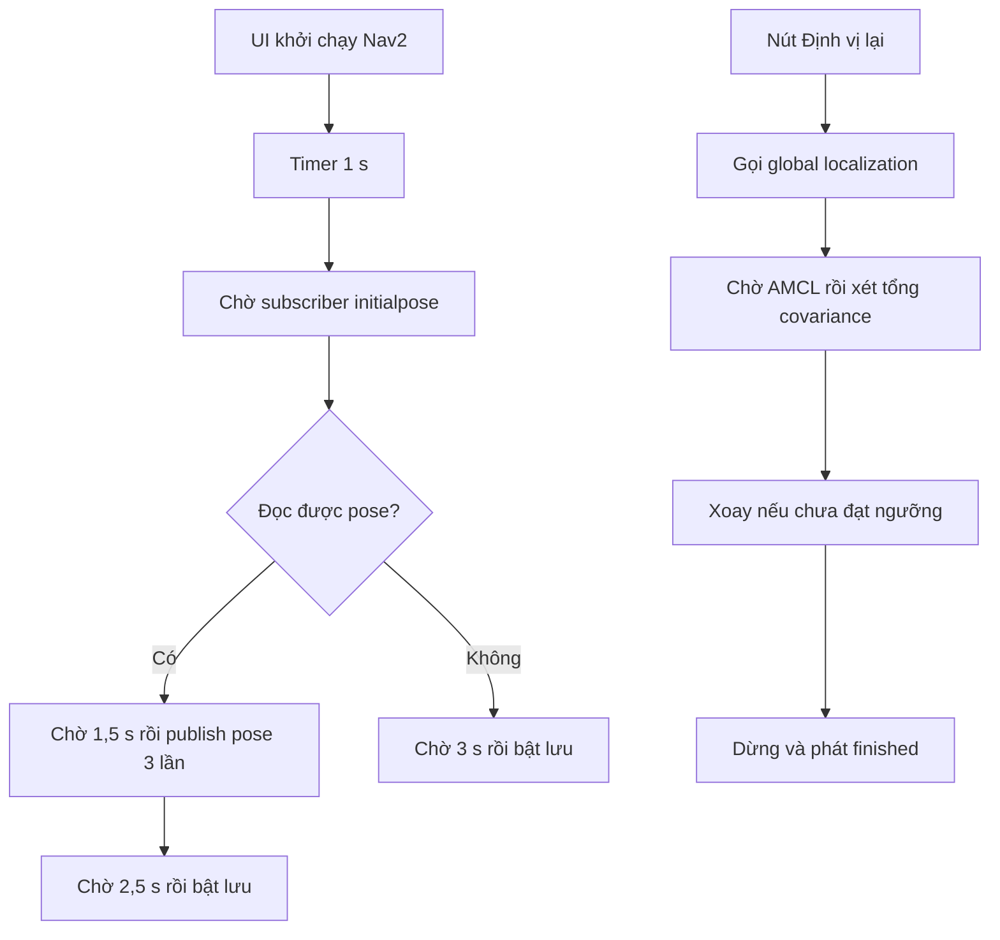
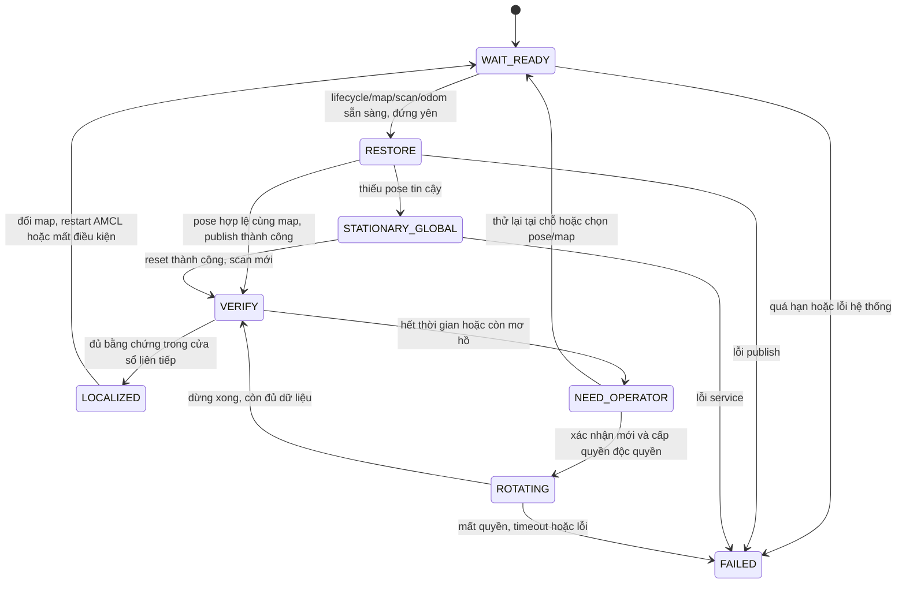

# Bàn giao: định vị đứng yên khi khởi động

Ngày khảo sát: 07/10/2026 (Asia/Ho_Chi_Minh). Baseline mã: `416db64` và
working tree đang có thay đổi của người dùng. Tài liệu này bàn giao khảo sát
mã, thiết kế đề xuất và kế hoạch kiểm thử; chưa triển khai state machine,
chưa hiệu chuẩn ngưỡng, chưa nghiệm thu mô phỏng/replay hoặc phần cứng.

Ràng buộc đã chốt: tự động định vị khi robot đứng yên. Chỉ xoay sau khi người
vận hành xác nhận riêng cho lần phục hồi đó. Khởi động, timeout, thử lại hoặc
mở lại UI không được coi là xác nhận xoay.

## 1. Baseline và bằng chứng

| Quan sát trong repo | Nguồn | Ý nghĩa |
| --- | --- | --- |
| `start_nav2` hẹn restore sau 1 s; nếu thấy tiến trình launch đã chạy thì trả về | `robot_ui/startup_layout.py`, `start_nav2` | Mở lại UI khi Nav2 còn chạy chưa chắc đi qua restore |
| Restore chỉ chờ có subscriber `/initialpose`, tối đa 80 lần cách 500 ms | `restore_last_robot_pose` | Subscriber không chứng minh lifecycle active, map hoặc scan sẵn sàng |
| Pose được gửi sau 1,5 s, lặp sau 300/600 ms; bật lưu sau 2,5 s | `_execute_publish_pose` | Chưa có xác nhận hội tụ; bản tin lặp dùng cùng timestamp |
| Không có pose hoặc đọc lỗi: bật lưu sau 3 s | `restore_last_robot_pose`, `_load_last_robot_pose` | Có thể lưu kết quả chưa kiểm chứng |
| File có frame, position, quaternion, 36 covariance và `saved_at`; ghi file tạm rồi replace | `_save_last_robot_pose` | Chưa có version/map identity; tuổi pose chưa được kiểm tra |
| Loader kiểm tra frame và chiều dài covariance, chưa kiểm tra finite/PSD/quaternion chuẩn hóa | `_load_last_robot_pose` | File đọc được vẫn có thể mang dữ liệu không hợp lệ |
| Nút định vị gọi global localization rồi xoay nếu tổng covariance chưa nhỏ | `start_reestimate`, `LocalizationWorker` | Chưa có hộp xác nhận xoay riêng; chưa kiểm tra quyền/action/TF/scan |
| Worker không chờ future global localization hoàn tất; dùng tổng x/y/yaw và giá trị tốt nhất trong quá khứ | `_run_sequence`, `_pose_callback` | Chưa chứng minh service thành công, dữ liệu mới hoặc chất lượng hiện tại |
| Dừng ở cuối sequence và trong nhánh exception; `finally` chỉ hủy node/phát finished | `LocalizationWorker.run` | Cần hợp nhất cleanup; finished hiện chưa phân biệt thành công/thất bại |
| AMCL bật `set_initial_pose`; YAML dùng `initial_pose_x/y/a: 0` | `src/view_robot/config/nav2_params.yaml` | Phải đối chiếu tên tham số thực tế trước khi sửa |
| Launch truyền map trực tiếp vào map_server, autostart quản lý `map_server`, `amcl`; AMCL respawn | `zackon_localization.launch.py` | Map chạy thực tế có thể khác map UI suy ra từ YAML |
| Pipeline LiDAR/localization/navigation khởi động bằng TimerAction sau EKF | `NAV2_BRINGUP.launch.py` | Độ trễ launch chưa phải điều kiện sẵn sàng |
| AMCL nhận `/merged`; merger khai báo `merged_topic: /merged_scan` | `nav2_params.yaml`, `merge_lidar.launch.py` | Bất nhất cấu hình cần xác minh parameter của merger và graph thực tế |
| EKF dùng `/odomfromSTM32`, `world_frame: odom`, phát TF | `src/view_robot/config/ekf.yaml` | Chuỗi kỳ vọng là AMCL `map → odom`, EKF `odom → base_link` |
| Localization ưu tiên 80, docking 70, UI 60, teleop 100 | `velocity_arbiter_core.py`, [motion-control.md](motion-control.md) | Localization có thể giành quyền nguồn khác |
| `navigation_busy` chặn `claim_ui`, không chặn trực tiếp input localization | `velocity_arbiter_core.py` | Chỉ kiểm tra trạng thái trước publish còn có race với goal mới |

Môi trường khảo sát có `ROS_DISTRO=jazzy`, `/opt/ros/jazzy/bin/ros2`, package
`nav2_amcl` và `nav2_lifecycle_manager` phiên bản **1.3.13**. Đây là bằng chứng
trên máy làm việc, chưa phải bản triển khai của robot.

Đối chiếu [mã AMCL chính thức, tag 1.3.13](https://github.com/ros-navigation/navigation2/blob/1.3.13/nav2_amcl/src/amcl_node.cpp):
tên tham số là `initial_pose.x/y/z/yaw`; `request_nomotion_update` yêu cầu cập
nhật ở scan tiếp theo mà không cần chuyển động. Đây là cơ chế đề xuất cho
định vị đứng yên, cần xác minh service/version trên robot. Phản hồi service
không chứng minh bộ lọc đã cập nhật hoặc định vị đúng.

Khảo sát DDS bằng `ROS_LOG_DIR=/tmp/zackon-localization-baseline timeout 8 ros2
node list --no-daemon` bị `getifaddrs`/UDP socket `Operation not permitted`.
Lệnh trả exit 0 nhưng không có graph đáng tin cậy. Chưa đo lifecycle, tần số,
QoS, TF, odometry, E-stop hoặc LiDAR thực tế. Không kết luận robot thiếu node.

### Luồng hiện tại



### Thu thập trên máy triển khai

Chỉ chạy các lệnh đọc dưới đây khi stack đã được người vận hành khởi động;
khảo sát không tự launch phần cứng, gửi initialpose, gọi reset hoặc phát Twist.

```bash
printenv ROS_DISTRO
ros2 pkg prefix nav2_amcl
ros2 node list --no-daemon
ros2 lifecycle get /map_server
ros2 lifecycle get /amcl
ros2 param dump /amcl
ros2 param get /map_server yaml_filename
ros2 param dump /dual_laser_merger
ros2 topic info /map --verbose
ros2 topic info /merged --verbose
ros2 topic info /merged_scan --verbose
ros2 topic info /amcl_pose --verbose
ros2 topic info /cmd_vel --verbose
ros2 service list -t
timeout 10 ros2 topic hz /merged
timeout 10 ros2 topic hz /odomfromSTM32
timeout 10 ros2 run tf2_ros tf2_echo odom base_link
timeout 10 ros2 run tf2_ros tf2_echo map odom
```

Điều chỉnh namespace theo graph. Lưu distro/package version, launch arguments,
map YAML/image và hash, parameter dump, graph/QoS, log startup có timestamp và
bag `/map`, scan thực tế, hai scan gốc, `/amcl_pose`, `/odomfromSTM32`,
`/odometry/filtered`, `/tf`, `/tf_static`, arbiter state, E-stop, các action
status và các nhánh vận tốc. Xác nhận QoS recording nhận được map/TF static.
Mỗi lần thử ghi mã ca, vị trí/hướng chuẩn, trạng thái robot có bị di chuyển khi
tắt máy không, mốc khởi động và lý do kết thúc. Bag chưa có trong bàn giao này.

Các giả thuyết cần kiểm chứng riêng: scan không tới AMCL do topic/parameter
merger; pose map cũ; initial pose mặc định ghi đè; TF khởi động trễ; mẫu retained
cũ; robot đã bị đẩy; quan sát môi trường đối xứng. Không coi đây là nguyên nhân
đã xác nhận của một sự cố phần cứng.

## 2. State machine và hợp đồng vận hành đề xuất



Mọi trạng thái có thể hủy; hủy đưa về trạng thái kết thúc `CANCELED` và khóa
lưu pose. E-stop, chuyển động ngoài dự kiến hoặc mất readiness làm hủy lần thử
hiện tại; không tự tiếp tục khi điều kiện hồi phục. Dùng generation/session ID
để callback, future hoặc timer cũ không publish/bật lưu sau khi đổi map, đóng
UI hoặc hủy. Timeout đo bằng monotonic; timestamp dữ liệu dùng ROS clock.

Các guard chung: lifecycle active và map đã nhận; TF `odom → base_link` và
scan → base sẵn sàng tại timestamp scan; scan/odom mới và hợp lệ; robot đứng
yên qua cửa sổ odometry; arbiter heartbeat mới/healthy, không E-stop, không
owner và không action accepted/executing/canceling. Chặn gửi goal/chuyển chế độ
trong lúc định vị; phải có trạng thái tin cậy cho docking, following và PS2
trực tiếp STM32. Trạng thái không biết được coi là chưa sẵn sàng.

Không yêu cầu `map → odom` trước RESTORE/STATIONARY_GLOBAL vì AMCL có thể chưa
tạo TF này khi chưa có pose. Sau khởi tạo, VERIFY bắt buộc kiểm tra toàn chuỗi
`map → odom → base_link`. Không phát zero liên tục để giữ đứng yên: Twist zero
cũng ảnh hưởng quyền điều khiển STM32, xem tài liệu motion-control.

Đề xuất UI: hiển thị “Chờ cảm biến/TF”, “Đang kiểm tra vị trí tại chỗ”, “Đã xác
nhận định vị” hoặc “Chưa đủ bằng chứng định vị” kèm lý do. Khi cần người vận
hành, có “Thử lại tại chỗ”, “Chọn vị trí trên map”, “Hủy”; chỉ hiện lựa chọn
“Xác nhận xoay hỗ trợ” khi chức năng phục hồi đã được triển khai và nghiệm thu.
Hộp xác nhận phải nêu hướng, tốc độ, giới hạn góc/thời gian đã cấu hình và nút
dừng. Thiếu profile hiệu chuẩn thì không cho báo LOCALIZED hoặc bắt đầu xoay.

## 3. Pose theo map và khởi tạo AMCL

Đề xuất schema v2, giữ position/orientation/covariance hiện có và bổ sung:

| Trường | Hợp đồng |
| --- | --- |
| `schema_version` | `2`; version chưa hỗ trợ bị từ chối |
| `map.identity_version` | Version thuật toán fingerprint, ban đầu `1` |
| `map.id` | SHA-256 của nội dung map đã chuẩn hóa, không dùng tên/path làm identity |
| `map.yaml_path` | Chỉ để truy vết file đã nạp |
| `frame_id` | `map` hoặc global frame cấu hình đã xác minh |
| `saved_at` | UTC Unix seconds, hữu hạn; không dùng ROS simulated time |
| `validation.profile_id` | Profile ngưỡng đã hiệu chuẩn cho map/cảm biến |
| `validation.session_id` | Lần kiểm tra tạo ra pose được lưu |
| `validation.validated_at` | UTC Unix seconds của lần xác nhận; không thay bằng thời điểm ghi file |

Fingerprint tính từ OccupancyGrid đang được AMCL sử dụng: frame, width/height,
resolution, origin position/quaternion và dữ liệu occupancy, với encoding/byte
order quy định và test vector cố định; loại timestamp/map_load_time. Chuẩn hóa
quaternion tương đương và số trước khi hash. Truy vết thêm hash YAML/image;
phải đối chiếu map server thực tế, không chỉ `get_current_map_path` (đọc YAML
cấu hình và lấy basename). Giữ map identity bất biến trong mỗi session.

Encoding đề xuất cho identity version 1: UTF-8 JSON với key sort, separator
cố định, cấm NaN; gồm các trường grid kể trên, quaternion chuẩn hóa với quy
ước dấu cố định và toàn bộ mảng occupancy. Quy định biểu diễn số và test vector
trước triển khai. Đổi tên/path nhưng giữ grid thì ID giữ nguyên; thay grid,
resolution hoặc origin thì ID thay đổi. Hash trùng không chứng minh layout
thực tế hoặc vị trí robot còn đúng.

File v1 thiếu map identity không tự migrate bằng map hiện tại: giữ nguyên để
truy vết, coi là gợi ý cần xác nhận rồi kiểm tra như pose nhập tay. Map mismatch,
file lỗi/thiếu, giá trị NaN/Inf, quaternion không hợp lệ, covariance sai kích
thước/không PSD, pose ngoài map hoặc không phù hợp vùng đặt robot đều không
được auto restore. Không tự đặt TTL: hiển thị tuổi pose, hỏi thông tin robot bị
di chuyển/layout thay đổi; tuổi pose không chứng minh tính đúng. Chính sách
TTL chờ vận hành chốt, chưa có nghĩa là pose luôn đáng tin cậy.

Thứ tự đề xuất: khóa lưu → xác minh map/lifecycle/scan/odom và đứng yên → kiểm
tra file → chọn một nguồn khởi tạo → publish initialpose với timestamp mới
hoặc global reset đứng yên → VERIFY → bật lưu sau LOCALIZED. Disable
`set_initial_pose` mặc định trong triển khai sau khi xác minh version; xử lý cả
AMCL respawn/reactivate và RViz initialpose. Một coordinator sở hữu khởi tạo;
initialpose ngoài coordinator làm mất xác nhận và kiểm tra lại. Retry có giới
hạn, không reset bộ lọc bằng publish lặp trong khi đang đánh giá hội tụ.

Đối chiếu thêm `always_reset_initial_pose` để không tái dùng pose nội bộ sau
reset/đổi map. Không chỉ đổi YAML nguồn: cần kiểm tra tham số runtime và map
AMCL đã nhận, kể cả khi launch override config hoặc build chưa hoàn tất.

Không có pose đáng tin: thử global localization đứng yên một lần trong session,
chờ service thành công rồi cập nhật no-motion có giới hạn và scan mới. Không
trộn reset global với restore; không gọi worker xoay hiện tại. Nếu không đủ
thông tin thì NEED_OPERATOR, yêu cầu chỉ vị trí/map hoặc xác nhận phục hồi.

Nếu service không khả dụng hoặc chưa xác minh compatibility, chuyển
NEED_OPERATOR. Chỉ gọi no-motion update khi có scan mới, không gửi dồn trên
một mẫu; service trả về không phải bằng chứng scan đã được xử lý. Tần suất,
số lần và deadline cần được hiệu chuẩn trước khi dùng tự động.

Lưu atomic như hiện tại; chỉ lưu mẫu hợp lệ mới trong session cùng map/profile.
Lỗi ghi phải giữ file cũ và báo lỗi. Khi mất guard/chất lượng, tắt lưu ngay;
không để một timer đã hẹn mở lại quyền lưu.

## 4. Tiêu chí xác nhận và hiệu chuẩn

Không cộng phương sai m² và rad². Dùng `sigma_position = sqrt(lambda_max(Cxy))`
với Cxy lấy từ covariance indices 0/1/6/7, và `sigma_yaw = sqrt(cov[35])`.
Kiểm tra covariance phẳng x/y/yaw hữu hạn, đối xứng, PSD; chuẩn hóa kiểm tra
quaternion. Covariance nhỏ chỉ là độ tự tin của bộ lọc, có thể sai trong vùng
đối xứng hoặc sau khi robot bị di chuyển.

| Chỉ số cần chốt | Cách đo | Giá trị hiện tại |
| --- | --- | --- |
| `max_sigma_position`, `max_sigma_yaw` | Đối chiếu mẫu AMCL với vị trí/hướng chuẩn trên nhiều vùng map | Chưa hiệu chuẩn |
| `max_pose_age`, `max_scan_age`, `max_odom_age`, `max_tf_age` | Timestamp ROS và thời điểm nhận monotonic; thống kê jitter/dropout | Chưa hiệu chuẩn |
| `min_unique_samples`, `stable_window`, `max_pose_drift`, `max_yaw_drift` | Mẫu timestamp tăng liên tiếp sau khởi tạo, độ lệch trong cửa sổ | Chưa hiệu chuẩn |
| `min_valid_beam_ratio`, coverage scan | Số beam hữu hạn trong range, độ phủ góc, frame/geometry hợp lệ; Inf theo semantics sensor | Chưa hiệu chuẩn |
| `max_stationary_speed`, `max_stationary_yaw_rate`, cửa sổ đứng yên | Odometry mới, độ trôi, trạng thái controller/STM32 | Chưa hiệu chuẩn |
| Sai số vị trí/hướng, tỷ lệ thành công, thời gian hội tụ nghiệm thu | Ground truth độc lập, thống kê từng nhóm ca và false acceptance | Chưa chốt |
| Giới hạn VERIFY/no-motion retry và chu kỳ gọi service | Replay/robot đo độ trễ, tải, số cập nhật mới thực sự | Chưa chốt |

Loại mẫu retained cũ, timestamp trùng/quay lùi/tương lai bất thường; reset cửa
sổ khi đổi clock/map/session hoặc mất guard. Đánh giá TF tại timestamp sensor;
AMCL post-date TF nên không chỉ so stamp TF mới nhất với now. Một mẫu không
đạt reset chuỗi ổn định. Không dùng `_best_cov` lịch sử để chấp nhận hiện tại.

Thu dữ liệu tại vùng đặc trưng và vùng đối xứng, nhiều hướng, mức che khuất và
độ trễ startup; tách tập hiệu chuẩn và nghiệm thu. Ghi ground truth, sai số
thực tế, các sigma/age/scan metrics cùng label đúng/sai; chọn ngưỡng ưu tiên
giảm false acceptance và báo cả ca không phân biệt được. Trường hợp tự tin
nhưng chưa chứng minh đúng vị trí cần đối chiếu scan-map đã được hiệu chuẩn
hoặc xác nhận vị trí độc lập; nếu thiếu thì NEED_OPERATOR, không ghi pose như
đã xác nhận. Chưa có dữ liệu nên bảng trên không phải profile chạy production.

## 5. Phục hồi xoay: thiết kế cho giai đoạn sau

| Điều kiện | Quyết định |
| --- | --- |
| VERIFY tại chỗ thành công | Không xoay |
| VERIFY thất bại, chưa có xác nhận | NEED_OPERATOR, không phát Twist |
| Nav2 busy, teleop/docking/following/UI giữ quyền hoặc trạng thái không biết | Từ chối; không tự hủy hoặc giành quyền |
| E-stop, heartbeat/scan/odom/TF stale, graph không healthy | Từ chối hoặc dừng phiên đang chạy |
| Có xác nhận mới, đủ guard và lease độc quyền | Cho xoay trong hạn đã hiển thị |
| Mất quyền, đổi map, hủy, timeout, exception | Kết thúc; không tự resume hoặc tự retry xoay |

Cần bổ sung claim/release lease cho localization và cơ chế khóa goal/chuyển
nguồn nguyên tử tại arbiter/coordinator; nhánh localization phải từ chối packet
khi không có lease. API hiện chỉ có `ui_control` và `release/teleop`, chưa đáp
ứng hợp đồng này. Đọc heartbeat rồi publish là chưa đủ để ngăn race. Xác nhận
gắn với map/session và giới hạn chuyển động, mất hiệu lực khi guard thay đổi.

Giới hạn tốc độ/góc/thời gian lấy từ quy trình phần cứng đã nghiệm thu, không
sao chép mặc định 0,314 rad/s hoặc các vòng xoay của worker làm ngưỡng an toàn.
Dùng watchdog monotonic, odometry đo góc thực, kiểm tra vùng quét footprint và
cảm biến trong suốt xoay. Dừng trong `finally`: gửi zero có giới hạn trước khi
release, hủy callback cũ và xác nhận odom đứng yên. Publish stop lỗi thì báo
thất bại, thu hồi lease và dựa watchdog đã kiểm chứng; không báo đã dừng nếu
chưa có bằng chứng. Zero localization không chứng minh nguồn khác/PS2 đã dừng.

Cleanup phải idempotent; lỗi gửi zero không ngăn thử release. Sau khi mất
lease, zero/release đến muộn không được dừng nguồn đang sở hữu mới. Mỗi xác
nhận chỉ cho phép một lượt; retry cần xác nhận mới. Trong toàn lượt xoay,
`linear.x=0` và giới hạn góc đo theo odom bên cạnh deadline monotonic.

## 6. Kiểm thử và nghiệm thu

Các test dưới đây cần bổ sung khi triển khai, dùng clock/scheduler/publisher/
service/arbiter giả; không gọi phần cứng trong unit test.

| Ca | Kết quả bắt buộc |
| --- | --- |
| Restore hợp lệ cùng map | Initialpose sau readiness; chưa lưu trước VERIFY; không Twist |
| Khởi động lại tại chỗ, Nav2 vẫn chạy khi mở lại UI | Session/readiness nhất quán, không bỏ qua kiểm tra hoặc reset goal đang chạy |
| Robot bị đẩy, AMCL covariance thấp nhưng sai | Không coi covariance thấp là đủ; NEED_OPERATOR nếu chưa chứng minh vị trí |
| Đổi map, cùng tên khác nội dung; đổi map giữa future/timer | Từ chối pose cũ; callback cũ vô hiệu; tắt lưu |
| File thiếu/hỏng/v1/version lạ/NaN/Inf/covariance âm/quaternion lỗi | Không restore tự động; giữ file, không timer bật lưu |
| AMCL im lặng, retained cũ, scan cũ/không hợp lệ, TF thiếu/clock reset | Không LOCALIZED; timeout hoặc yêu cầu vận hành với lý do rõ |
| Service reset/no-motion lỗi hoặc future đến muộn | Không ghi thành công; không resume session bị hủy |
| Publish initialpose/velocity/stop ném exception | Cleanup đúng, lưu khóa; stop lỗi được báo và lease thu hồi |
| Hủy/đóng UI/restart AMCL khi VERIFY | Không lưu, không publish từ timer cũ |
| Có goal mới đúng lúc xin quyền xoay | Không giành quyền; kiểm tra từ chối nguyên tử |
| Xác nhận xoay, sau đó mất sensor/quyền/E-stop/timeout | Dừng/cleanup, không retry nếu chưa xác nhận mới |
| Lỗi ghi pose hoặc mất chất lượng sau LOCALIZED | File cũ giữ nguyên; khóa lưu cho tới lần xác nhận tiếp theo |

Replay dùng domain cách ly, tắt toàn bộ đường tới phần cứng; replay bag đơn
thuần không chứng minh phản hồi sau initialpose/global reset. Cần AMCL chạy
thật với clock/sensor/TF phù hợp và thu output mới, hoặc mô phỏng closed loop.
Thử robot theo quy trình vận hành: vùng trống, người giám sát/E-stop, xác nhận
riêng trước mỗi lần xoay; không tự chạy thử phần cứng từ script CI.

Checklist nghiệm thu còn mở: bản ROS/Nav2 triển khai và graph được xác minh;
scan topic/QoS đúng; bộ bag/ground truth đủ ca; profile được ký nhận; schema
và map fingerprint có test vector; unit/ROS/replay pass; false acceptance và
sai số nằm trong tiêu chí đã chốt; không Twist trong mọi ca tự động; xoay có
lease/xác nhận và stop được kiểm chứng; lưu chỉ khi đủ bằng chứng.

### Báo cáo chạy baseline tại workspace

`venv` chưa có pytest. Chạy unittest arbiter: **14/14 pass**. Discovery
`test_motion*.py`: **31 test pass**, module `test_motion_navigation` không
import được vì thiếu pytest; đây là giới hạn runner, không phải lỗi assertion.
Chạy lại bằng Python hệ thống có pytest: **104/104 pass**, hai cảnh báo
deprecation `aifc`/`audioop` từ speech_recognition, với lệnh:

```bash
QT_QPA_PLATFORM=offscreen python3 -m pytest tests/test_motion_commands.py tests/test_motion_integration.py tests/test_motion_navigation.py tests/test_velocity_arbiter.py -q
```

Chưa chạy test DDS, replay, mô phỏng hoặc phần cứng. Chưa bổ sung test localization khi hợp đồng/ngưỡng
chưa được triển khai; bảng trên là ca kiểm thử bàn giao, không phải test đã pass.

Đã chạy lại lệnh pytest trên khi tiếp tục bàn giao: **104 pass**, cùng hai
cảnh báo deprecation. Thay đổi lần này chỉ hoàn thiện tài liệu; chưa thay
đổi `startup_layout.py`, AMCL config hoặc hành vi chuyển động.

## Quyết định cần chốt trước triển khai

1. Chấp nhận thử global localization/no-motion tại chỗ khi không có pose tin
   cậy; khi mơ hồ, vận hành nhập vị trí hay xác nhận xoay hỗ trợ?
2. Chính sách tuổi pose theo cách cất giữ, robot bị di chuyển và layout thay
   đổi; không đặt TTL tùy ý.
3. Tiêu chí sai số vị trí/hướng, tỷ lệ thành công/false acceptance và thời gian
   hội tụ, rồi hiệu chuẩn profile bằng dữ liệu thực tế.
4. Tín hiệu tin cậy cho trạng thái PS2/STM32, docking/following và cơ chế lease
   khóa goal; chưa có guard đầy đủ thì chưa triển khai xoay.
